# BMacro
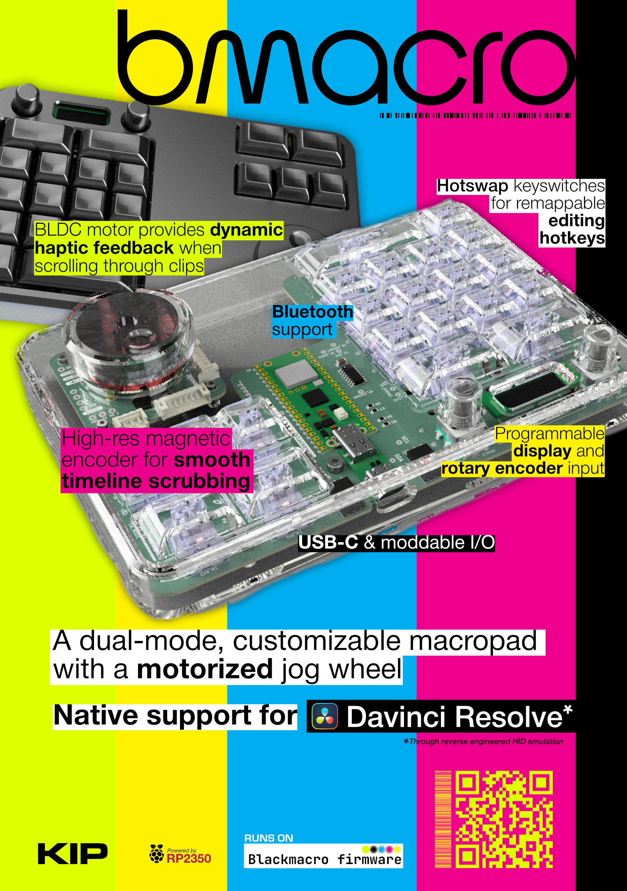
A bluetooth-capable condensed macro keyboard with a motorized jog wheel, powered by a Raspberry Pi Pico 2W.

Supports remappable keyboard input, smooth scrolling, MIDI input, or
driverless Davinci Resolve control through reverse-engineered HID emulation.

Each key is a hotswappable MX-style plateless switch with a reverse-mounted addressable RGB LED. The 2u and 1.5u in/out clips/timeline keys also feature screw-mount stabilizers.

The jog wheel is driven by a FOC-controlled brushless DC motor and a magnetic angle encoder, allowing for user-definable
haptic feedback and buttery smooth scrolling when working through your video timeline.

#### This hardware is purpose-built for blackmacro-lib. For more information on the purpose of this device, see [blackmacro-lib](https://github.com/KipJM/blackmacro-lib).

> ### Name
> Help me pick a better name for this thing...

# Why
Bmacro (or Blackmacro keyboard) is designed to be an open source, leaner, customizable, and more powerful alternative to the Davinci Resolve Speed Editor keyboard.

The original speed editor features keys that aren't remappable and is locked to the Davinci Resolve software, only some of its keys feaure single-color LEDs,
plus its jog wheel doesn't feature the mechanical clutch found on its bigger Editor Keyboard sibling. Bmacro improves on this in almost every way, then adding
additional knobs to expand its input capabilities! While it features less keys than the Speed Editor, each key is software remappable so you can have the inputs you actually need.
Inspired by the smartknob project, the jog wheel is replaced with a Field Oriented Controlled BLDC motor, not only allowing it to emulate a mechanical clutch, but also other [software-defined haptic feedback!](https://www.youtube.com/watch?v=J9192DfZplk)

Running the FOSS Blackmacro firmware, bmacro can not only fully emulate all features of the Speed Editor and interface with Davinci Resolve without the need for any drivers,
but it can also emulate other inputs, such as smooth scrolling, volume control, generic macropad, or MIDI input. Through the rotary encoder knob and the 0.91 inch OLED screen, you can switch between these modes.

# License
This project is licensed under the CERN Open Hardware Licence Version 2 - Weakly Reciprocal.

# Folder Structure
This project is made up of two PCBs and a case. The PCB project and production files can be found inside each board's folder within PCB/. For Bill of Materials, please also see each board's respective bom/bom.csv.

# BOM
You can find a merged BOM of all parts at the root of this project, however for more info please see the board-specific BOMs.

Bill of materials are separated by boards, please see `bom.csv` within the the bom/ folder of each PCB. `Quantity` is the amount of that part used on this board, `Actual Total Cost` represent the amount I spent to satify the entire project's needs on that particular component, so it's influenced by my inventory, regional price differences, and discounts, so it should only serve as a rough estimate of how much the project's gonna cost you. If "-" is in place of the price entry, it means the price has already been listed elsewhere (or on another BOM).

Also note that any `LCSC #` values you find in the KiCAD project are likely incorrect!

# Electronics
The project is made up of two boards:
- The dial board (aka the jog wheel board)
- The base board (aka the keyboard board)

Use each PCB's respective `{name}_bom.csv` for purchasing parts, I recommend using the interactive BOM HTML for part placement reference.

## Dial board
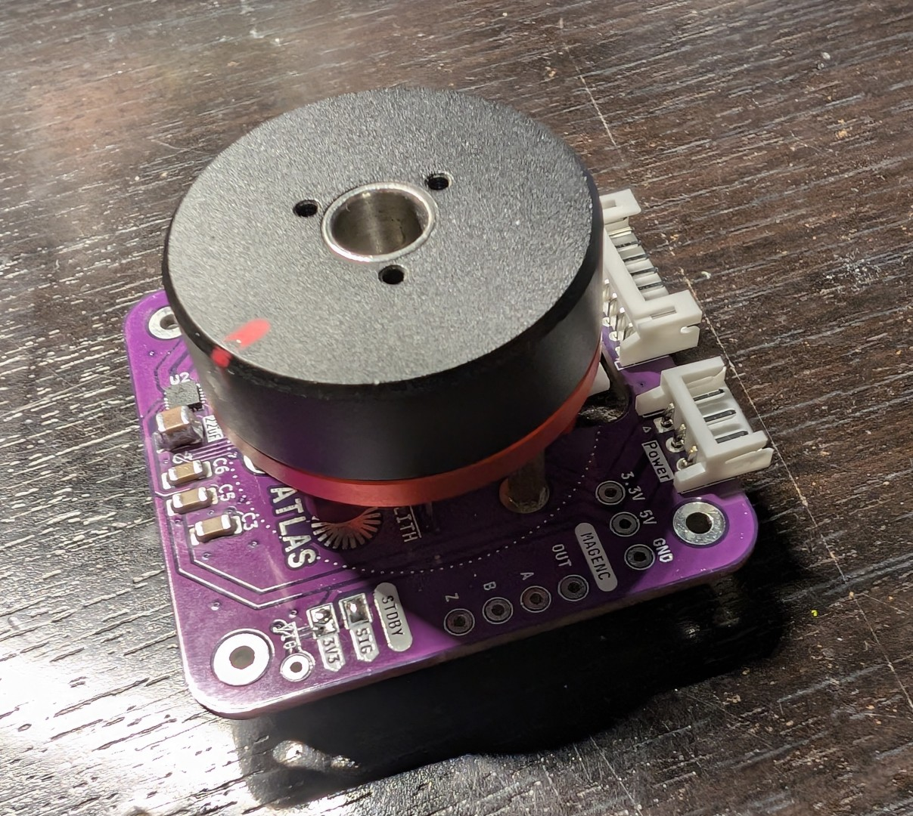
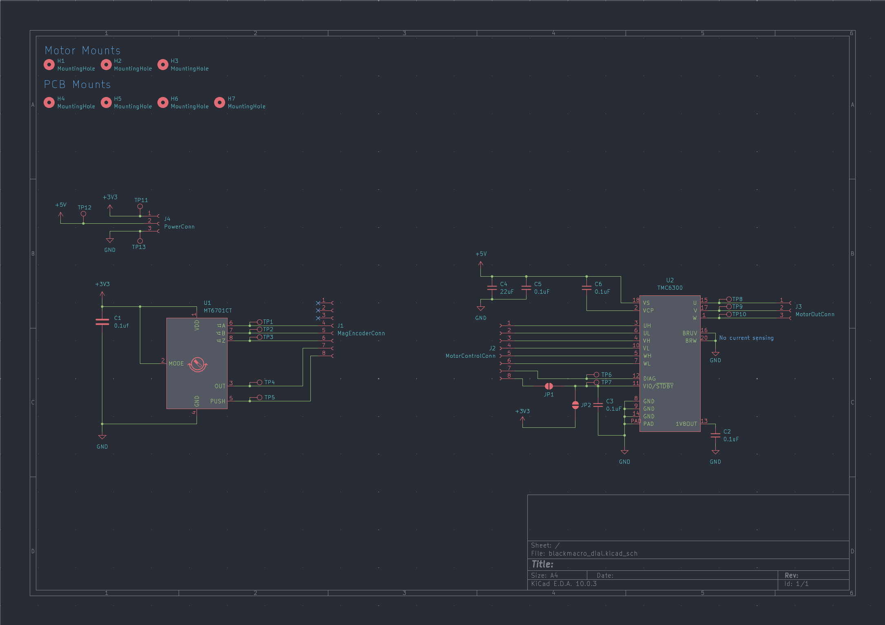

|                                                 |                                               |
|:-----------------------------------------------:|:---------------------------------------------:|
|  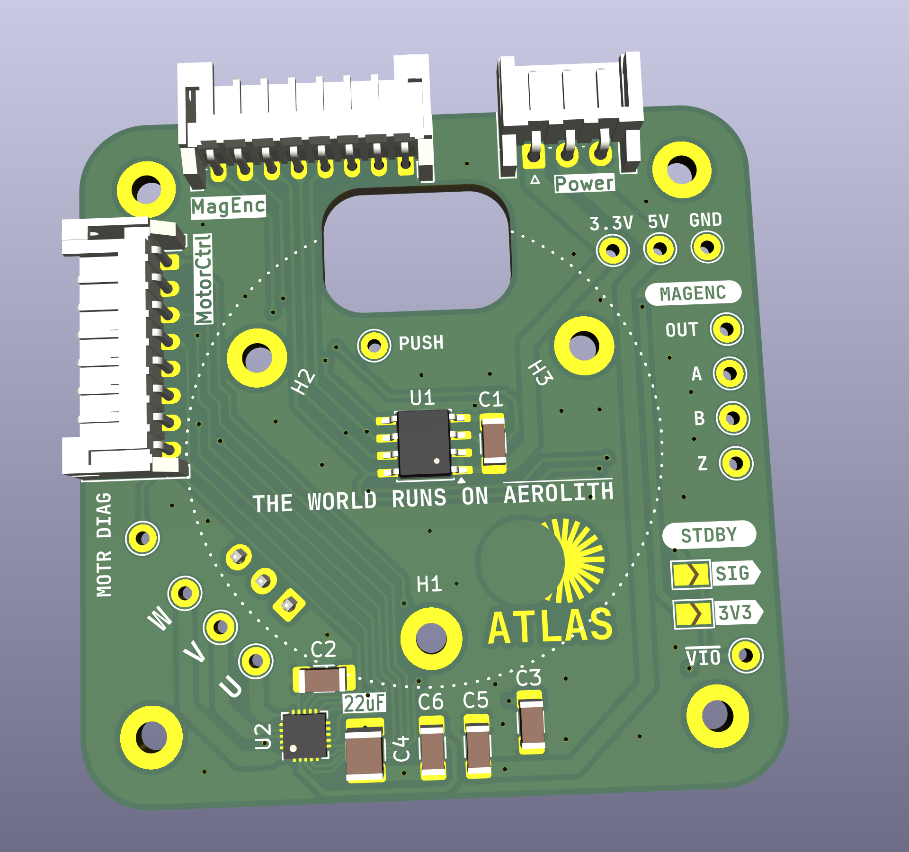  |  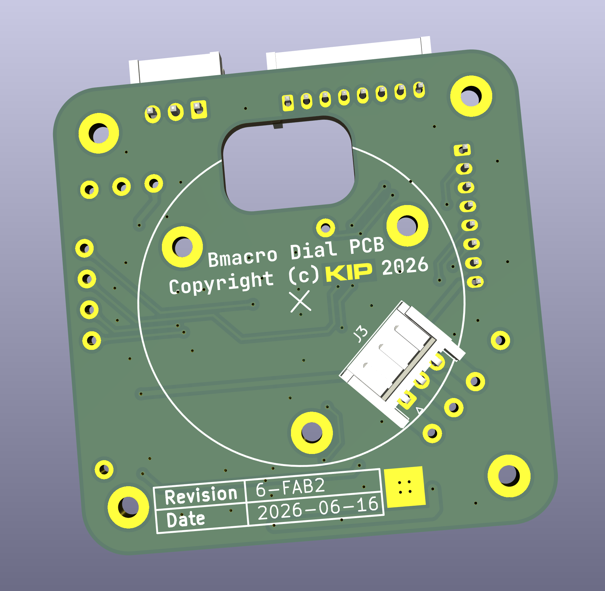  |
| 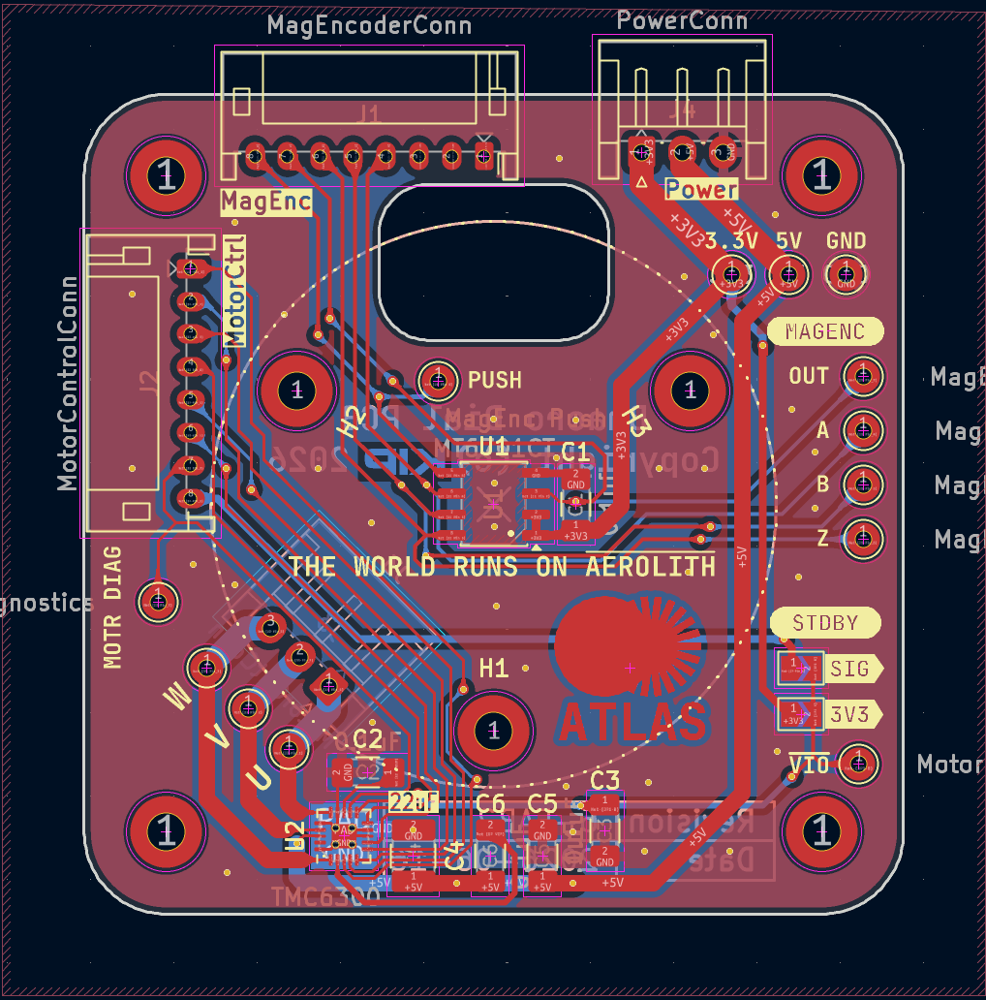 | 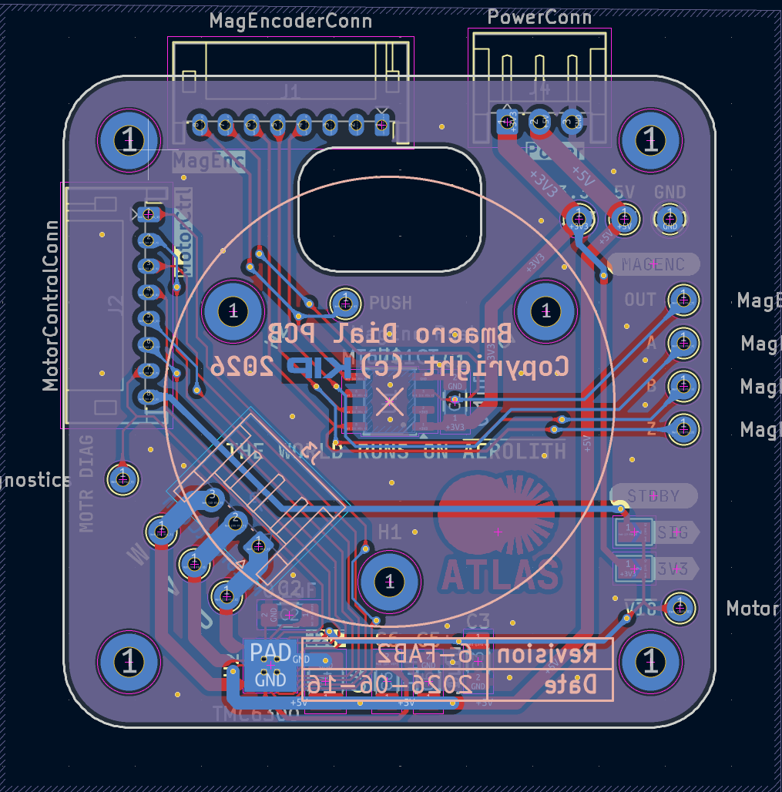 |

The motor driver, TMC6300, is only available in QFN packages. I recommend purchasing a stencil along with your PCB (at least get solder paste and flux).
You should get a cable along with your motor terminated on one side as a small JST male connector, you'll need to crimp a 3-pin JST EH connector on the other side.

Use standoffs and flathead M2 screws to attach the motor to the PCB. The standoffs length is purposely chosen so the motor's builtin diametric magnet would be
perfectly aligned on top of the MT6701 magnetic encoder with the correct air gap. Unfortunately this means the push button functionality is not present, but you can
add this feature back by replacing the standoffs with stiff springs.

There are two solder jumpers letting you select how the motor controller chip should be activated. Use a soldering iron and a bit of solder, swipe right to bridge the connection, swipe left to break the connection. **You should only have one connected at a time.**
I recommend setting it to SIG, if set to 3V3, the motor driver will stay on as long as there's power, and the MCU cannot command it to go to sleep through the SIG pin.

## Base board
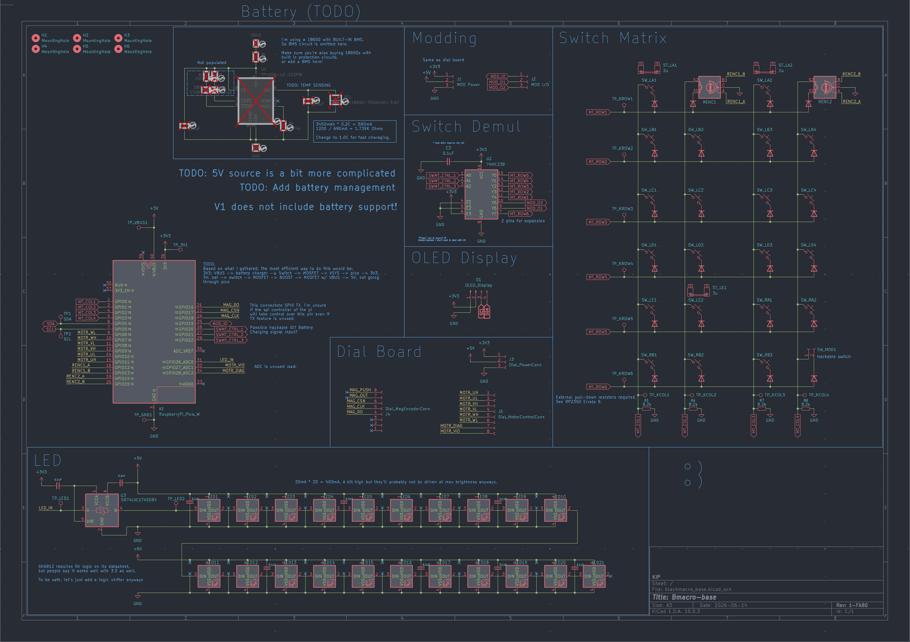

|                                                  |                                               |
|:------------------------------------------------:|:---------------------------------------------:|
| 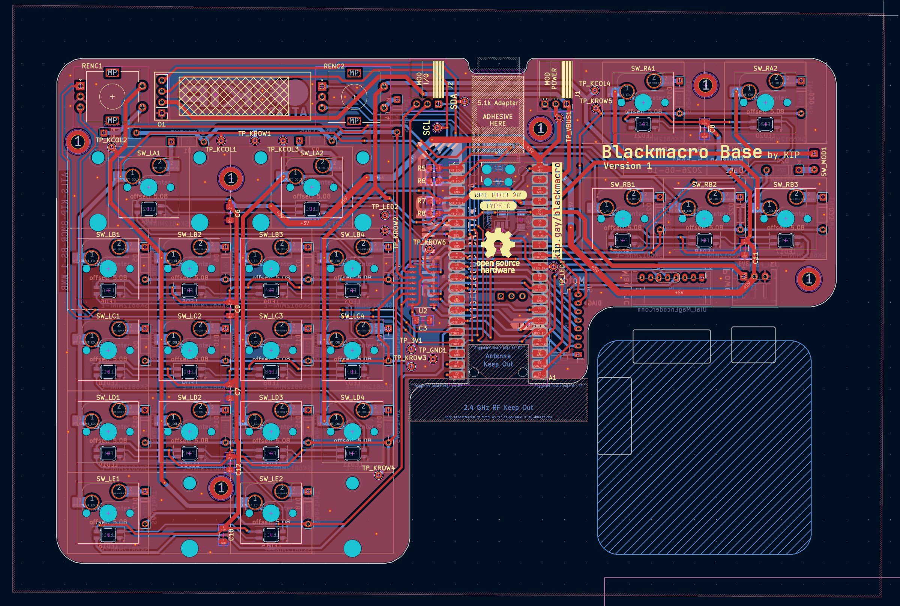  | 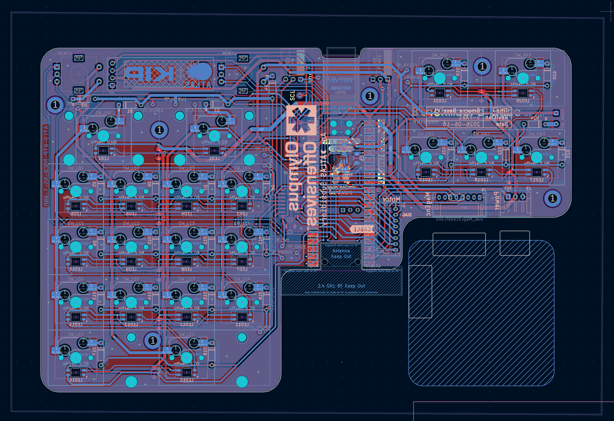 |
|  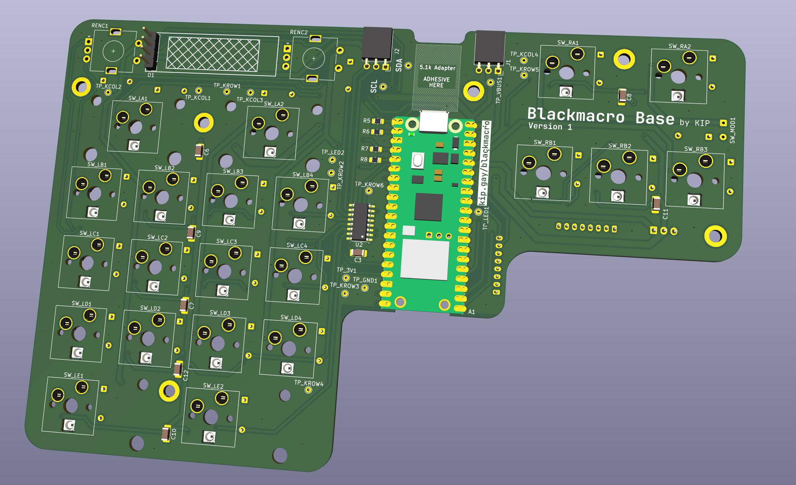   |  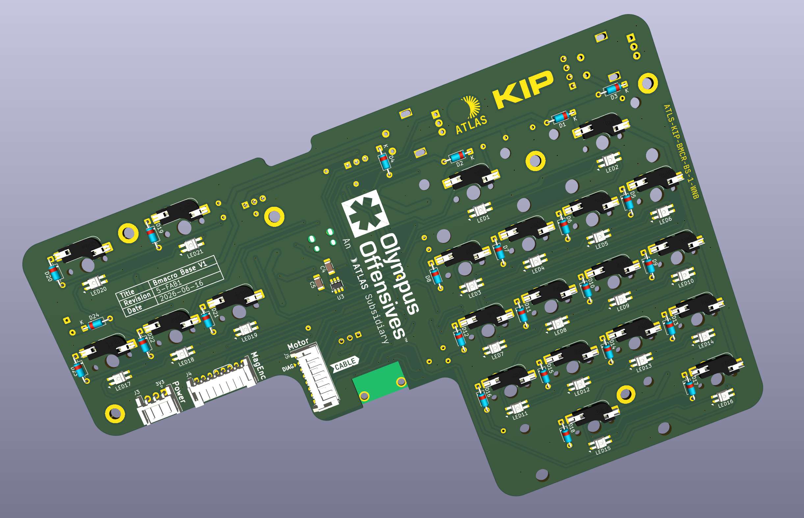  |

The base board is designed with hotswap connectors, but the holes are plated so you technically can directly solder switches onto it.

You'll find a few additional interesting features on the base board:
- **The cutout:** the board is designed to work with a USB-C Pico **2W** clone board, for the best Bluetooth performance,
the pcb is cut out under and in front of the pico's antenna. The board's design is probably overkill, I'll probably optimize it in V2.
- **The shape:** The space under the pico is reserved for a battery in version 2 of this project. Due to the increased complexity
and cost battery monitoring and its powerchain would add to this project, battery support has been delegated to a potential V2 of this project.
- **The 5.1K adapter:** There is a space above the pico intended for you to glue on a 5.1k usb-c adapter. Type-C Pico 2W clone boards basically all come from one
factory, and its designer forgot to add the 5.1k resistor on its CC pin to enable C-to-C connection and a higher current limit. If you omit the adapter, you'll only be able to connect
to the keyboard with an A-to-C cable. You can find extremely cheap 5.1k type-c enabler/adapters on Aliexpress (which also seem that all come from one factory) 
Extract the adapter, connect it to the pico, and glue it onto the PCB with double-sided tape. This is cheaper than fabbing a PCB and sourcing the resistors yourself.

I recommend fabbing the base PCB in white for better RGB LED performance.

When making the board interconnect cables, MAKE SURE the polarity is correct so that the correct pins are connected. You can see silkscreen showing reference pins.

A stencil is not required, but flux/solder paste is recommended.

# 3D printed parts
Parts list:
- Case bottom
- Case top
- (optional) jog wheel

### Case
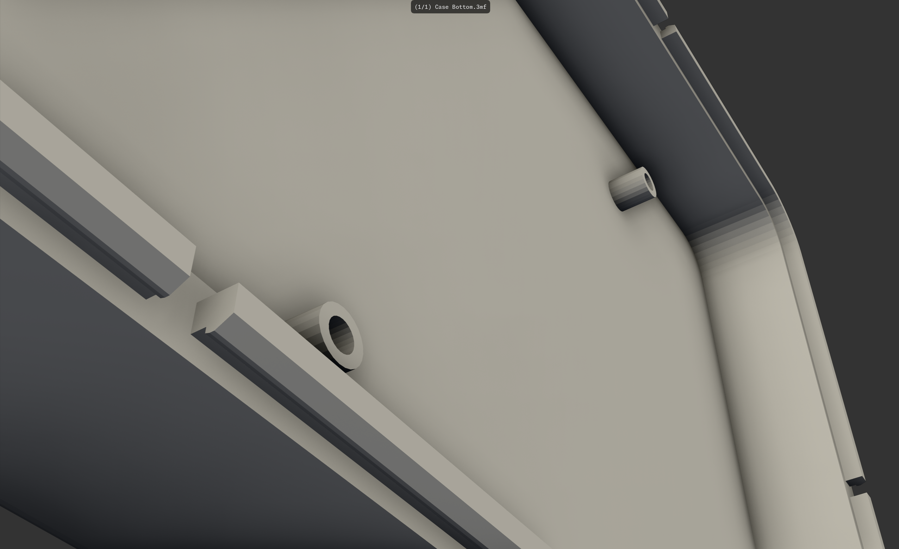
The top and bottom part of the case is designed to be snapped shut without the need of any fasteners. Cuts are put into the snap connector to prevent cracking, but you may
need to add more cuts depending on the material you're using (designed for PLA+, aka more flexible PLA).

For the case bottom, you'll need to melt heatset inserts into the poles to mount the pcbs. Ensure you're using M3 inserts for the base portion, and
M2 inserts for the dial PCB.

### Jog wheel
The jog wheel is optional, but if you do choose to print it, just add glue (or double sided tape) on the underside of the wheel, then stick it onto the motor
by aligning the three screw pins. There is no need to use screws. You may want to sand the divet portion depending on your layer height settings.

# The Motor
Unfortunately, there is no information on the manufacturer or datasheet of the motor used in this project. It seems to be from a leftover stock of motors that many small AliExpress vendors are reselling.

There should be a red ring at the bottom with three pin headers, two functionless 01x02 pins and one 01x03 UVW header. Make sure you're getting one that rotates 360 degrees with no limit mechanism.

The quality of the motor seems to vary, with some having low amounts of cogging, and some with none whatsoever. You may need to buy multiple to get one without cogging, but it's worth it (it's quite cheap anyways)!

The resellers use the same three images on their listings, lookup "2806 bldc" / "2806无刷电机" on AliExpress and you'll find a vendor.
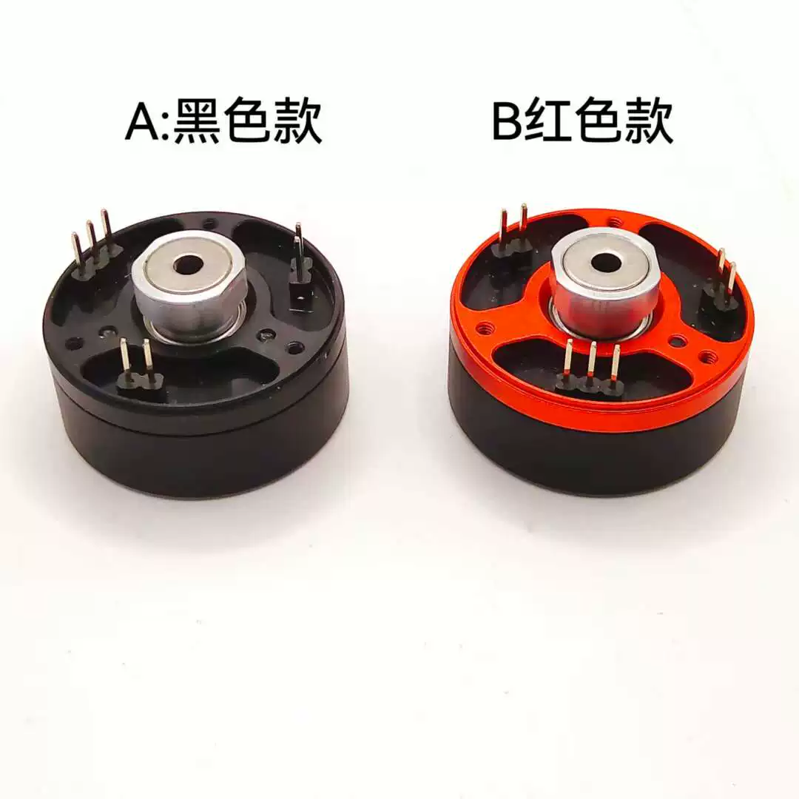

# Firmware
For now, please see https://github.com/KipJM/blackmacro-lib.

# References
- https://github.com/shaise/DiSE
- https://github.com/scottbez1/smartknob
- https://github.com/dmcke5/Hapticpad

This project is not affiliated with or endorsed by Blackmagicdesign and Davinci Resolve. This is not an official product.

**KIP**
