# BMacro V2
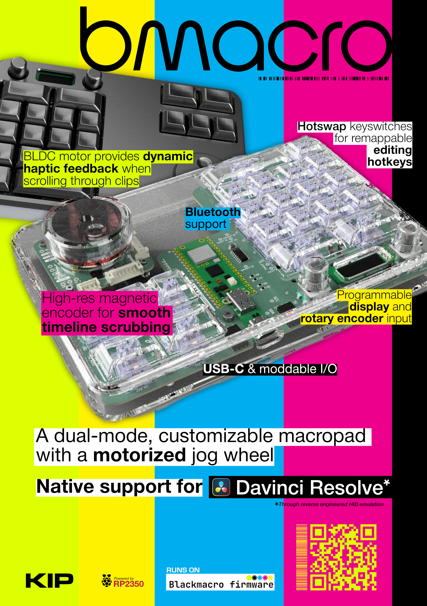

> # V2 Is Work in Progress!
> While all the project and fabrication files are fully finished, I have not fully tested them yet. 
> Beware that the BOM and README has not been updated yet!
> Proceed with caution! However I do not recommend building V1 anymore, as it includes a critical wiring error with the logic shifter.

A bluetooth-capable condensed macro keyboard with a motorized jog wheel, powered by a Raspberry Pi Pico 2W.

Supports remappable keyboard input, smooth scrolling, MIDI input, or
driverless Davinci Resolve control through reverse-engineered HID emulation.

Each key is a hotswappable MX-style plateless switch with a reverse-mounted addressable RGB LED.
The 2u and 1.5u in/out clips/timeline keys also feature screw-mount stabilizers.

The jog wheel is driven by a FOC-controlled brushless DC motor and a magnetic angle encoder, allowing for user-definable
haptic feedback and buttery smooth scrolling when working through your video timeline.

#### This hardware is purpose-built for blackmacro-lib. For more information on the purpose of this device, see [blackmacro-lib](https://github.com/KipJM/blackmacro-lib).

> ### Name
> Help me pick a better name for this thing...

> You're looking at version 2. For V1 archive switch to branch v1.

# Why
Bmacro (or Blackmacro keyboard) is designed to be an open source, leaner, customizable, and more powerful alternative to the Davinci Resolve Speed Editor keyboard.

The original speed editor features keys that aren't remappable and is locked to the Davinci Resolve software, only some of its keys feaure single-color LEDs,
plus its jog wheel doesn't feature the mechanical clutch found on its bigger Editor Keyboard sibling. Bmacro improves on this in almost every way, then adding
additional knobs to expand its input capabilities! While it features less keys than the Speed Editor, each key is software remappable so you can have the inputs you actually need.
Inspired by the smartknob project, the jog wheel is replaced with a Field Oriented Controlled BLDC motor, not only allowing it to emulate a mechanical clutch, but also other [software-defined haptic feedback!](https://www.youtube.com/watch?v=J9192DfZplk)

Running the FOSS Blackmacro firmware, bmacro can not only fully emulate all features of the Speed Editor and interface with Davinci Resolve without the need for any drivers,
but it can also emulate other inputs, such as smooth scrolling, volume control, generic macropad, or MIDI input. Through the rotary encoder knob and the 0.91 inch OLED screen, you can switch between these modes.

# License
This project is licensed under the CERN Open Hardware Licence Version 2 - Weakly Reciprocal.

Copyright © KIP 2026.

**Any individual or corporate entity are strictly forbidden from training "generative AI" analytical neural networks (LLMs, etc.) on contents of this project.**

Selling fabricated hardware of this project as-is is strongly discouraged. Please reach out to me at [kip@kip.gay](mailto://kip@kip.gay).

# Features
- 21 MX-style south-facing hotswap sockets
- Fully addressable RGB backlight LED for each key
- 2 Alps-style rotary encoder with click input

- High fidelity jog dial powered by the MT6701 magnetic encoder, **accurate to 0.02 degrees**
- BLDC Motorized jog dial power by the TMC6300 motor driver, providing dynamic haptic feedback

- 6000mAh built-in battery, enough battery life for over 40 hours of **non-stop usage**
- Efficient power management
- Seamless power handoff when disconnecting/connecting USB

- **An actual power switch**
- USB-Type C input

- Sandwich-mount style case
- Cool PCB designs :)

- Powered by Raspberry Pi Pico 2W
- Original moddable firmware
- Native compatibility with Davinci Resolve (unofficial)
- Wide HID emulation capability, can also act as a mouse/keyboard/game controller/MIDI device
- Bluetooth & WLAN capable

# Folder Structure
This project is made up of two PCBs and a case. The PCB project and production files can be found inside each board's folder within PCB/. For Bill of Materials, please also see each board's respective bom/bom.csv.

# BOM
You can find a merged BOM of all parts at the root of this project, however for more info please see the board-specific BOMs. The master BOM might be incorrect.

Bill of materials are separated by boards, please see `bom.csv` within the the bom/ folder of each PCB. `Quantity` is the amount of that part used on this board, `Actual Total Cost` represent the amount I spent to satify the entire project's needs on that particular component, so it's influenced by my inventory, regional price differences, and discounts, so it should only serve as a rough estimate of how much the project's gonna cost you. If "-" is in place of the price entry, it means the price has already been listed elsewhere (or on another BOM).

Also note that any `LCSC #` values you find in the KiCAD project are likely incorrect!

# Electronics
The project is made up of two boards:
- The dial board (aka the jog wheel board)
- The base board (aka the keyboard board)

Use each PCB's respective `{name}_bom.csv` for purchasing parts, I recommend using the interactive BOM HTML for part placement reference.

## Dial board
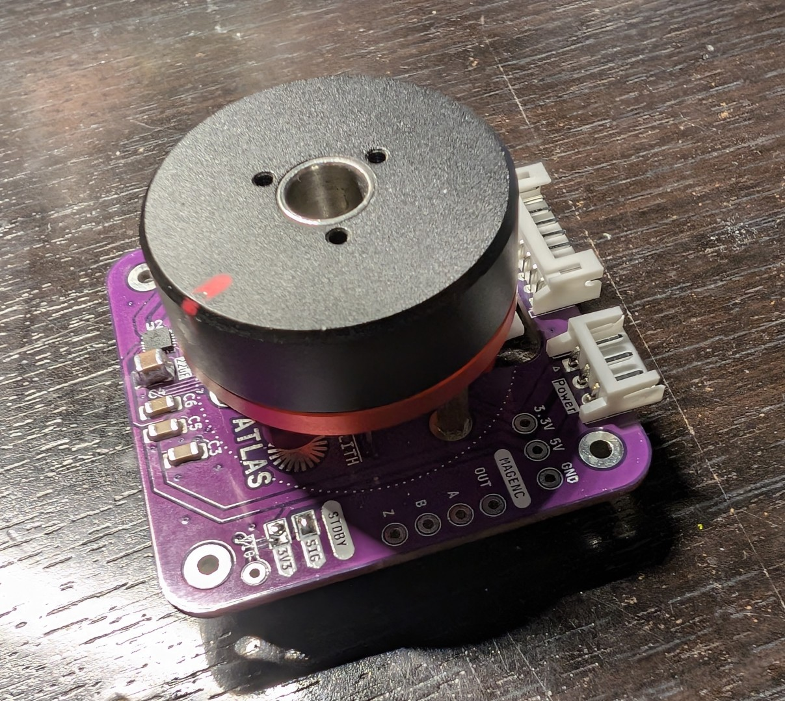
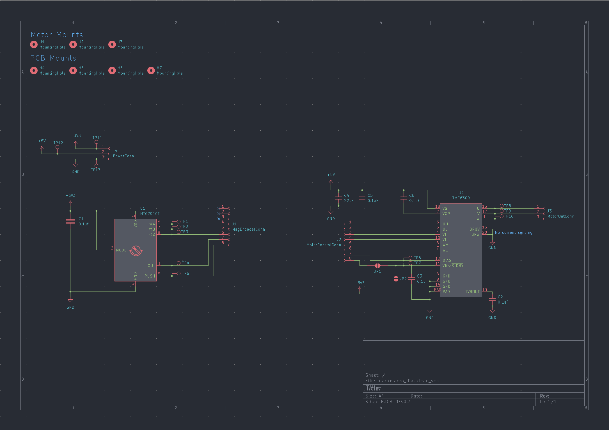

|                                                 |                                               |
|:-----------------------------------------------:|:---------------------------------------------:|
|  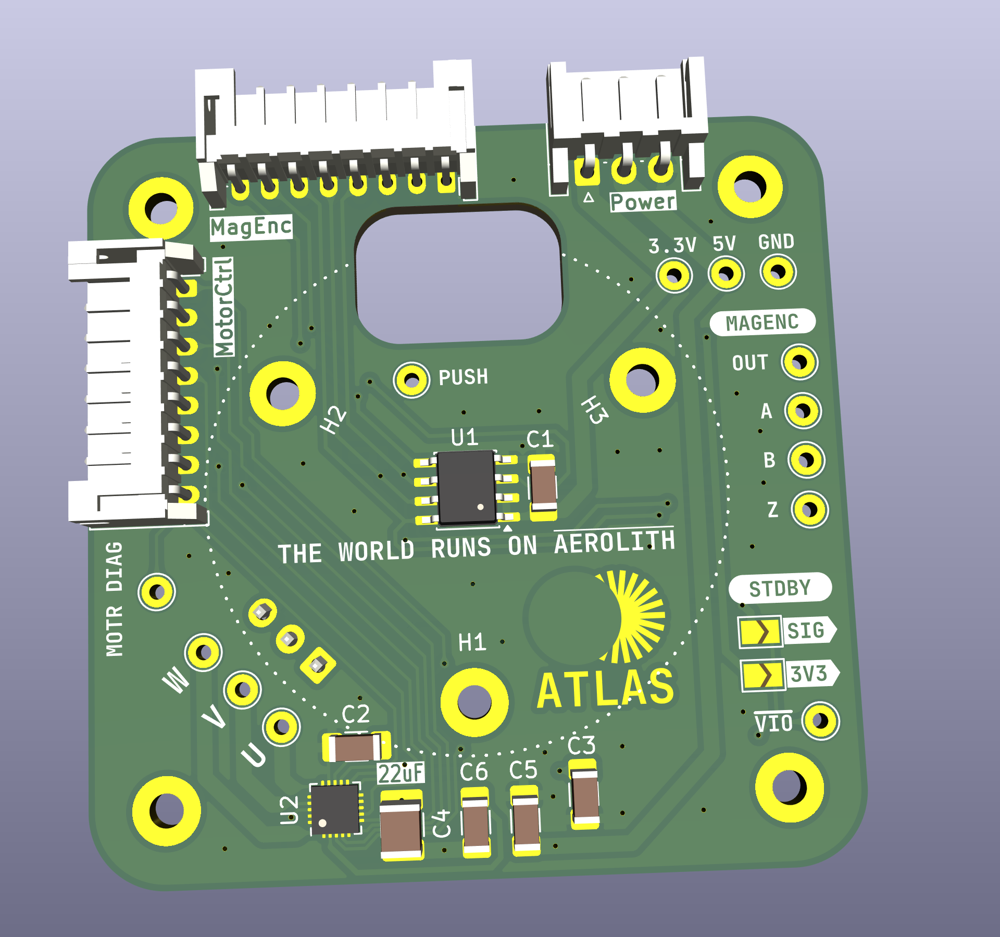  |  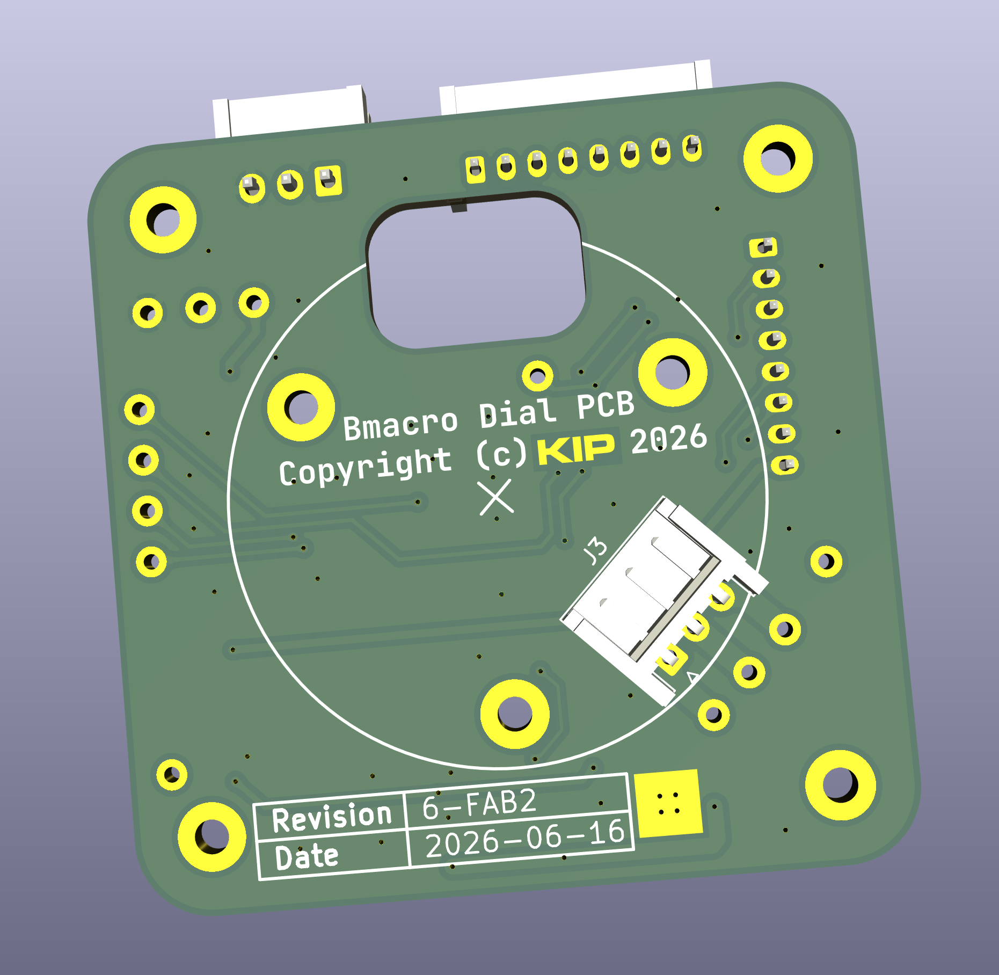  |
| 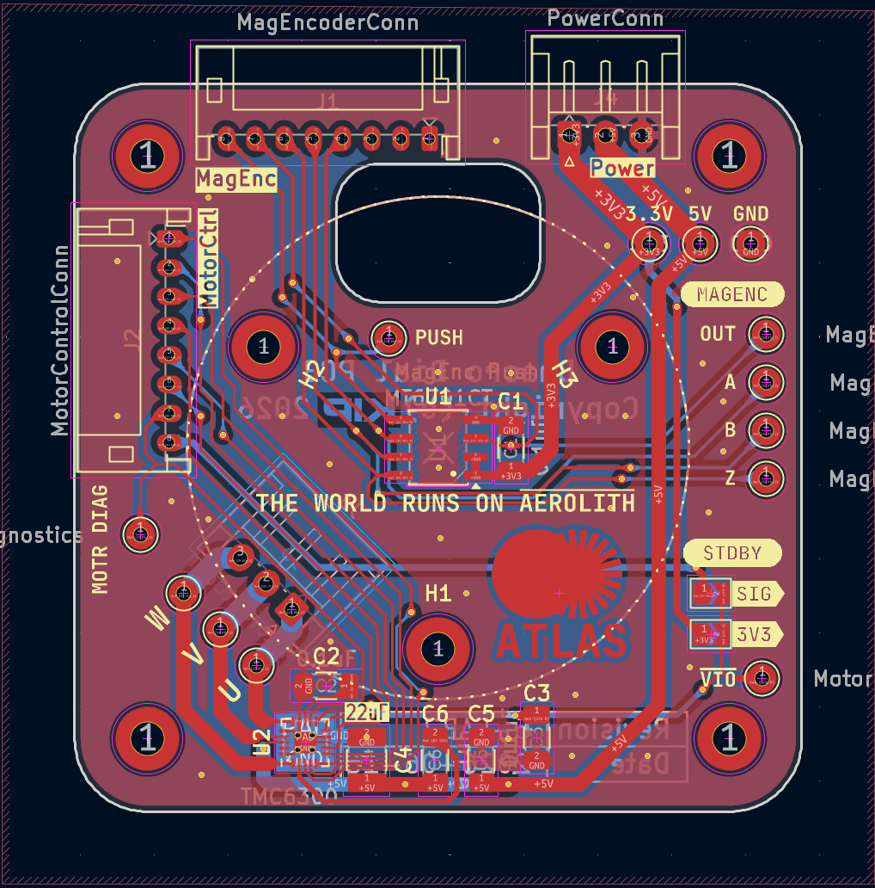 | 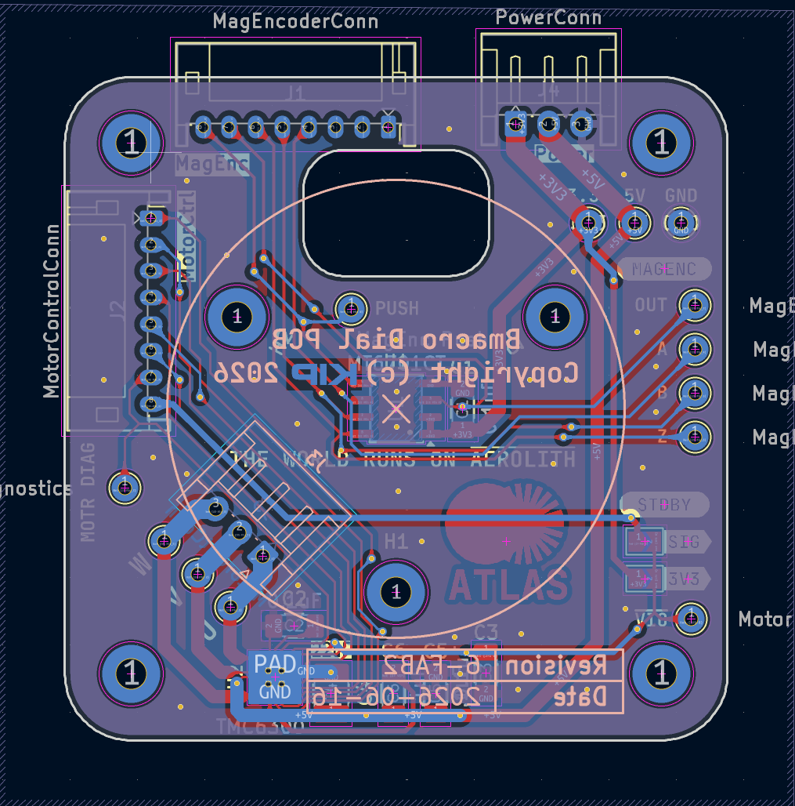 |

The motor driver, TMC6300, is only available in QFN packages. I recommend purchasing a stencil along with your PCB (at least get solder paste and flux).
You should get a cable along with your motor terminated on one side as a small JST male connector, you'll need to crimp a 3-pin JST EH connector on the other side.

Use standoffs and flathead (as in the head is flat) M2 screws to attach the motor to the PCB. The standoffs length is purposely chosen so the motor's builtin diametric magnet would be
perfectly aligned on top of the MT6701 magnetic encoder with the correct air gap. Unfortunately this means the push button functionality is not present, but you can
add this feature back by replacing the standoffs with stiff springs.

There are two solder jumpers letting you select how the motor controller chip should be activated. Use a soldering iron and a bit of solder, swipe right to bridge the connection, swipe left to break the connection. **You should only have one connected at a time.**
I recommend setting it to SIG, if set to 3V3, the motor driver will stay on as long as there's power, and the MCU cannot command it to go to sleep through the SIG pin.

## Base board
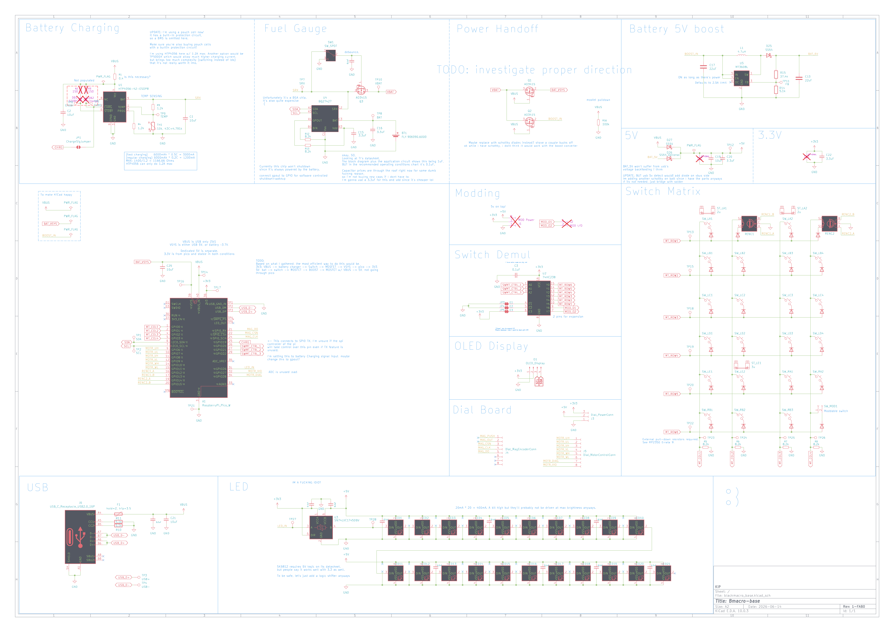

|                                                  |                                               |
|:------------------------------------------------:|:---------------------------------------------:|
| 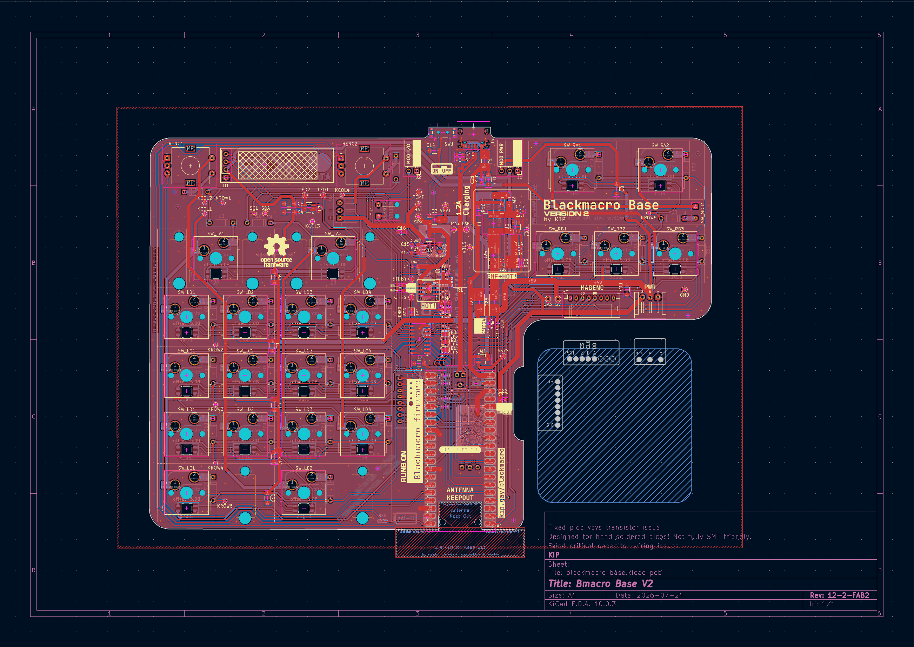  | 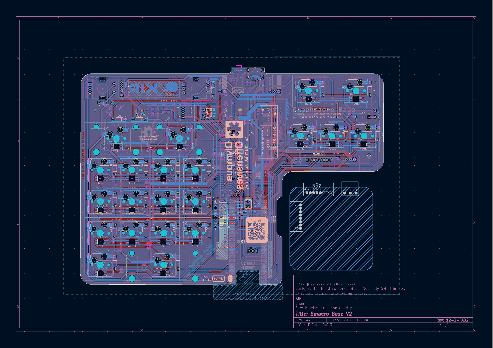 |
|  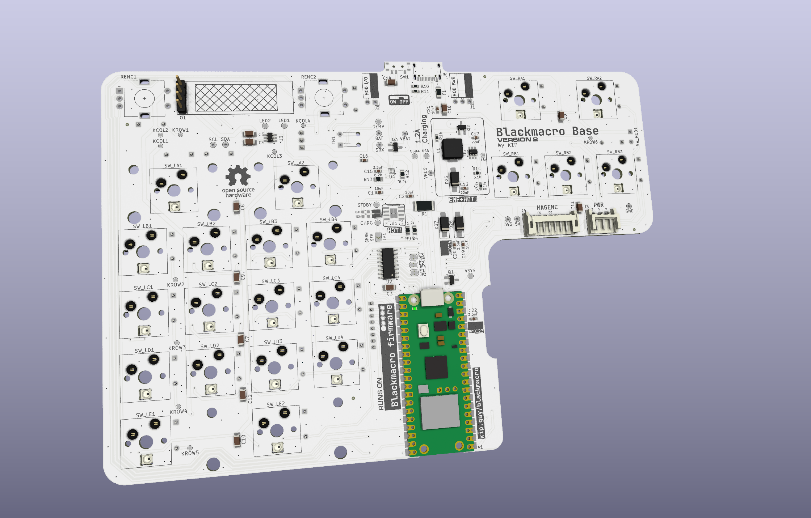   |  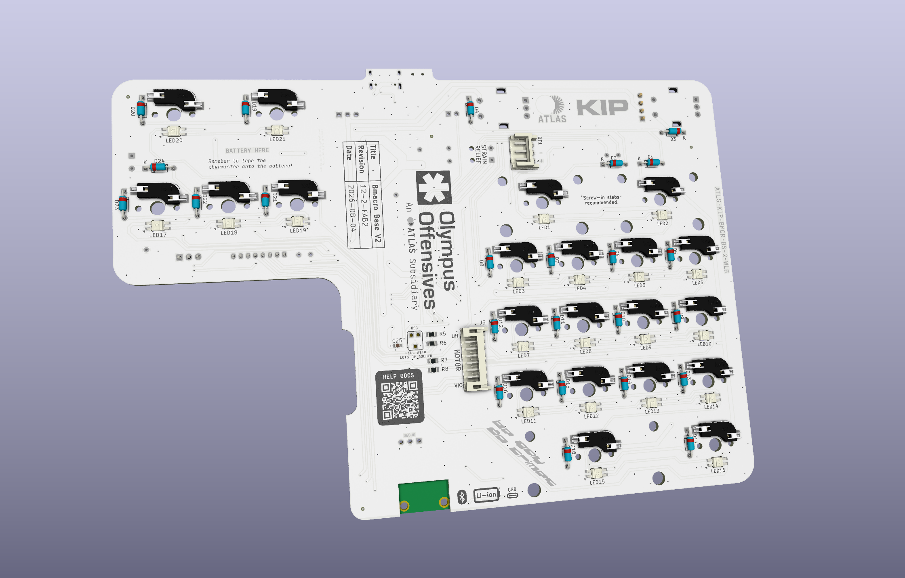  |

The base board is designed for hotswap connectors, but the holes are plated so you technically can directly solder switches onto it.

> ## Make sure you're building the 11-2-fab2 or later versions of this board!
> 10-2-fab1, the initially fabricated version that I built this project on, includes a critical error with the logic shifter circuitry.
> If you built the 10-2-fab1 version, you'll have to remove the `C4` and `C5` capacitors and replace them with solder bridges, otherwise your LEDs won't work.

A few notable features of the base board:
- **The cutout:** the board is designed to work with a Pi Pico 2W. For the best Bluetooth performance,
the pcb is cut out under the pico's antenna.
- **Battery charging:** This board uses the HTP4056, a modified clone of the TP4056 that allows for a higher charging current.
- **USB**: The pico features three rectangular testpoints on the bottom for USB connections. To make this board hand solderable,
These TPs are connected through THTs. After soldering the pico to the board, fill the THTs with solder (use more than you would), then verify with a multimeter
that they have been soldered correctly. **This also means that the board is not full-SMT friendly. Beware!**
- **Stabilizers:** Screw-in stabilizers recommended. You'll need to get two 2U and one 3U steel wire.
- **Keycaps:** **16** 1U, **2** 1.5U, **2** 2U, **1** 3U.
- **MagEnc:** Most pins are unused. However, for extra rigidity terminate the other wires too!
- **Battery:** You'll have to terminate the battery leads into the JST connector. The top pin is unused.
- **Battery temperature probe:** For the NTC temperature probe, route its wires through the strain-relief so the leads
are inserted from the top of the board, and the probe should be at the bottom. Then tape the probe onto the battery with heat-resistant tape (safe at 40C min.)

I recommend fabbing the base PCB in white for better RGB LED performance. _(plus it just looks better)_

This board includes a 16-pin type-C port, DSBGA-9, and ESOP, which are hard to solder and requires a hotplate. I therefore recommend
getting partial PCBA for them and basic components.

When making the board interconnect cables, MAKE SURE the polarity is correct so that the correct pins are connected.
You can see silkscreen showing reference pins.

A stencil or hotplate is not required if you got partial PCBA, but flux/solder paste is highly recommended.

# 3D printed parts
Parts list:
- Case bottom
- Case top
- Plate
- (optional) jog wheel

> #### INFO!
> I do not recommmend printing the case, especially the plate, using PLA+ or regular PLA,
> It will sound very pingy!
>
> Instead, consider getting them fabricated using resin, laser-cut POM/Sheet metal, or CNC'd aluminium. 

# Case & Assembly
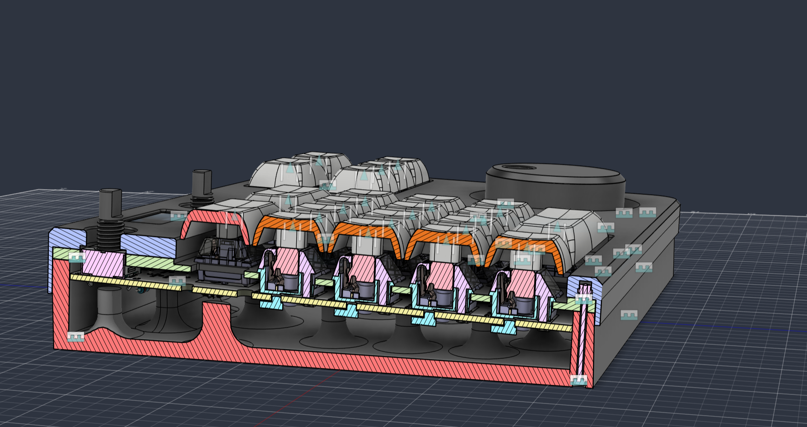
The case uses a sandwich-style mechanical keyboard mounting setup, with special modifications for the the jog wheel.

The `Assembly V2` Fusion 360 archive file contains all mounting details, including fasteners and heat-set inserts. Use
that as assembly reference.

### Switches
Should be the same as any mechanical keyboard. Search online for mech keyboard assembly guides.

### Heat-set Inserts, Standoffs, and Screws
This project uses two types of M2 screws, one type of M2 standoff, and one type of M2 heat-set inserts.

The specifications of each part is carefully chosen, make sure you get fasteners with the exact same specs.

### Battery
After taping the NTC temperature probe to the top side of the battery, apply double-sided foam tape
onto the battery compartment of the bottom case. Stick the battery onto the tape, and apply padding onto the compartment
walls if necessary.

### Assembly Order
After the heat-set inserts are installed, assemble the device in the following order:
1. I recommend driving the screws through the holes once before to drive out any excess support material.
2. Install screw-mounted stabs onto the PCB
3. Assemble all switches onto the plate
4. Tape the battery to the bottom case
5. install the dial board onto the case using standoffs
6. connect the pcb to the battery
7. preconnect all interconnect cables onto the dial board, leaving the base-side hanging.
8. snap the plate onto the pcb, install the pcb into the bottom case
9. connect all interconnect cables
10. screw in the four dial board mounting screws on the plate
11. install the OLED display
12. install the top case
13. screw in all six screws from the bottom, stop when the case is sealed shut.

### Sound
If printed out of PLA+, the keyboard will sound very pingy and hollow when assembled.
Fill the cavity in the case with foam, and consider doing tape/polyfil mods.

### Jog wheel
The jog wheel case is optional, but if you do choose to print it, just add glue (or double sided tape) on the underside of the wheel, then stick it onto the motor
by aligning the three screw pins. There is no need to use screws. You may want to sand the divet portion depending on your layer height settings.

If it doesn't fit, you can also clip off thez alignment pins on the part.

# The Motor
Unfortunately, there is no information on the manufacturer or datasheet of the motor used in this project. It seems to be from a leftover stock of motors that many small AliExpress vendors are reselling.

There should be a red ring at the bottom with three pin headers, two functionless 01x02 pins and one 01x03 UVW header. Make sure you're getting one that rotates 360 degrees with no limit mechanism.

The quality of the motor seems to vary, with some having low amounts of cogging, and some with none whatsoever. You may need to buy multiple to get one without cogging, but it's worth it (it's quite cheap anyways)!

The resellers use the same three images on their listings, lookup "2806 bldc" / "2806无刷电机" on AliExpress and you'll find a vendor.
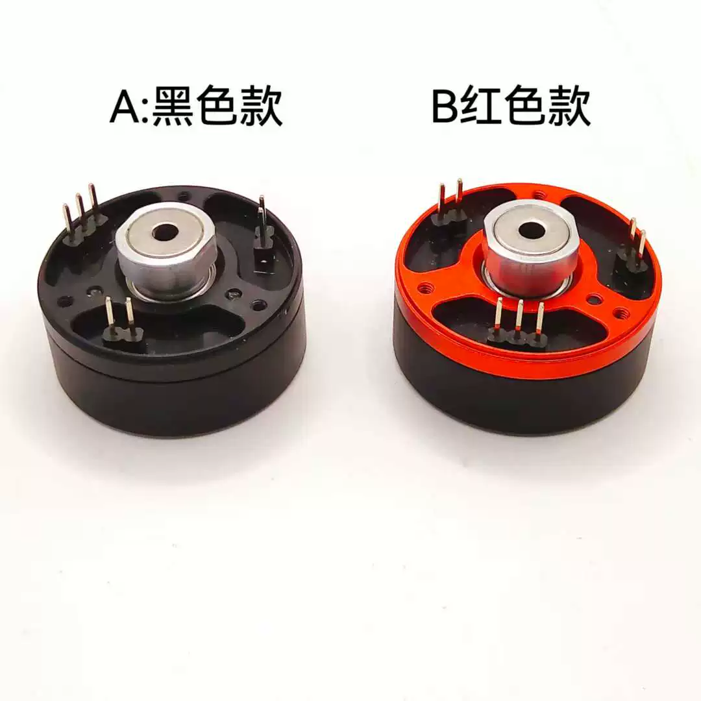

# Firmware
For now, please see https://github.com/KipJM/blackmacro-lib.

WIP full firmware is at https://github.com/KipJM/blackmacro-firmware.

# References
- https://github.com/shaise/DiSE
- https://github.com/scottbez1/smartknob
- https://github.com/dmcke5/Hapticpad
---

This project is not affiliated with or endorsed by Blackmagicdesign and Davinci Resolve.

Bmacro _(a.k.a. Blackmacro keyboard)_ is a fully original electronics hardware designed and fabricated by me, **KIP**. I am licensing this project under the CERN Open Hardware License Version 2 - Weakly Reciprocal. I reserve its copyright and the right to sell this hardware and its designs.

_Copyright © 2026_ **KIP**
